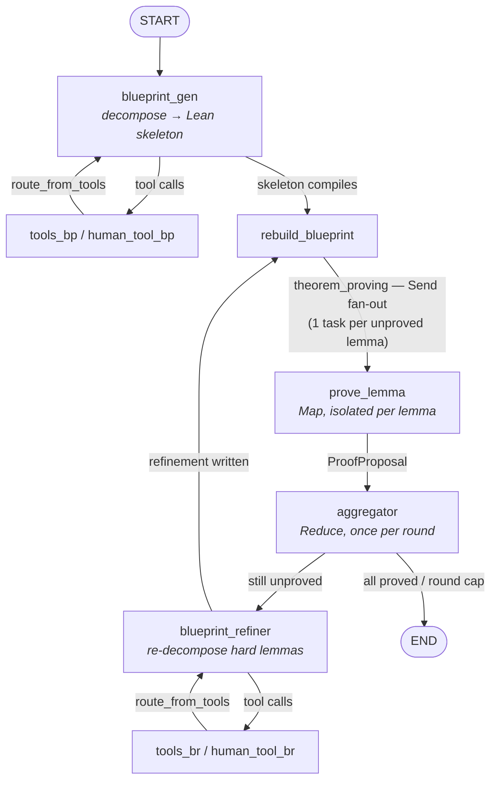

# Conjecture Prover

A multi-agent automated theorem prover for **research-level mathematics**.

Given a theorem (as natural language, an informal proof sketch, or an existing
Lean statement), the system decomposes it into a Lean-compiling *blueprint* — a
dependency DAG of sub-lemmas — proves those sub-lemmas in parallel with isolated
agents, and then re-decomposes any lemma that resists proof, looping until every
node in the graph is `sorry`-free or the round budget is exhausted.

It is built on the **Gödel Architect** blueprint-refinement architecture,
orchestrated with **LangGraph**, verified against **Lean 4 + Mathlib**, and
driven by LLM agents that interact with Lean through an **MCP** server.

---

## Table of contents

- [Why this exists](#why-this-exists)
- [Architecture](#architecture)
- [Pipeline stages](#pipeline-stages)
- [The blueprint is the source of truth](#the-blueprint-is-the-source-of-truth)
- [Agents and tools](#agents-and-tools)
- [State and control flow](#state-and-control-flow)
- [The Lean workspace](#the-lean-workspace)
- [Repository layout](#repository-layout)
- [Setup](#setup)
- [Running](#running)
- [Configuration reference](#configuration-reference)
- [Testing](#testing)
- [Engineering notes](#engineering-notes)

---

## Why this exists

Modern provers have become strong on **contest mathematics**, but the same
systems collapse on **research-level** problems. The interesting failure mode is
not reasoning: frontier models can often reason about these problems correctly
in natural language. The failure is **translation** — turning that reasoning into
verifiable Lean code, in an environment that is young, dense with type-class
inference, and missing many definitions a working mathematician would take for
granted.

Three consequences shaped the design:

1. **Reasoning and formalisation should be separate stages.** A model asked to
   both think and translate does neither well, and tends to spiral into
   self-consistent but false assumptions ("conversational inertia"). Splitting
   the work into a *planning* stage and a *proving* stage lets each stage use a
   model suited to it, and lets a bad plan be revised without discarding
   whatever was already proved.
2. **Reflection should be structural, not vibe-based.** Rather than asking a
   model to judge whether a proof strategy "seems right", the blueprint makes the
   strategy an explicit graph. Progress and failure are then read from the Lean
   source itself, which is a deterministic signal rather than an opinion.
3. **Cost matters.** Because the stages are decoupled and the proof work is
   parallelised per sub-lemma, the architecture aims to match strong specialised
   provers at a fraction of their per-problem cost.

The system targets research-level benchmark suites where existing provers are
far from saturation, and is designed to grow into formalising *novel* papers
rather than only solving fixed problem sets.

---

## Architecture



The graph is a **Map/Reduce** over the blueprint DAG: `prove_lemma` is the Map
(fanned out with LangGraph `Send`, one task per unproved lemma, each with its
own Lean REPL session and turn budget), and `aggregator` is the Reduce (runs
exactly once per round, after fan-in).

---

## Pipeline stages

| Node | File | Responsibility |
|---|---|---|
| **Blueprint generator** | `nodes/blueprint_generator.py` | Decomposes the input theorem into a `@[blueprint]`-annotated Lean skeleton — every sub-lemma's signature must type-check against the others, bodies left as `sorry`. Uses file, Lean, Mathlib-doc and retrieval tools; may `ask_human` for clarification. |
| **Blueprint refiner** | `nodes/blueprint_refiner.py` | Takes the lemmas that are still unproved and splits them into smaller sub-lemmas, using LeanArchitect's same-label multi-declaration support so the dependency graph stays intact. |
| **Rebuild blueprint** | `nodes/routing.py` (`rebuild_blueprint`) | Regenerates the blueprint JSON and re-derives per-lemma statuses **from the Lean source**, so graph state can never drift from the file. |
| **Theorem proving (fan-out)** | `nodes/routing.py` (`theorem_proving`) | Reads the workspace once, splices each unproved lemma out by its line range, and dispatches one `Send("prove_lemma", …)` per lemma that still carries a `sorry_using [...]` placeholder. |
| **Prove lemma (Map)** | `nodes/prove_lemma.py` | An isolated agent proves exactly one lemma against its own Lean REPL session. It never writes the canonical file — it returns a `ProofProposal`. |
| **Aggregator (Reduce)** | `nodes/aggregator.py` | The single writer. Applies the round's accepted proposals, verifies with Lean diagnostics, regenerates the blueprint JSON, and rolls the file back if the build breaks. |

### Round structure

1. `blueprint_gen` writes a compiling skeleton and regenerates the blueprint JSON.
2. `rebuild_blueprint` parses that JSON and derives statuses from the source.
3. `theorem_proving` fans out one prover per unproved lemma.
4. `aggregator` applies the surviving proposals, verifies, rebuilds — one round.
5. If anything is still unproved and the round cap is not hit, the refiner
   decomposes the failures and the loop repeats from step 2.
6. Otherwise the graph ends and an end-of-run summary reports how many nodes
   were left unsolved.

---

## The blueprint is the source of truth

The `.lean` file — not a hand-maintained dictionary in graph state — is
authoritative. `blueprint.py` is the *only* module that owns the data model:

- `Blueprint.from_blueprint_json()` parses the node array emitted by
  `lake build :blueprintJson`. It prefers `proof.usesLabels` (resolved graph
  edges) over `proof.uses` (Lean names), normalises the absolute `file` paths
  Lean writes into project-relative paths, and records each node's `start_line` /
  `end_line` from the location range.
- `Blueprint.nodes` **are** the `LemmaTask` units of work — there is no separate
  node class and no converter layer, so a node identity cannot diverge between
  the JSON, the state, and the prover input.
- `derive_lemma_statuses_from_workspace()` reads the real proof bodies each
  round to decide what is `proved` versus `unproved`. This matters because the
  LeanArchitect JSON export has no `sorryFree` field — deriving status from JSON
  alone would report zero progress forever and the round loop would never
  terminate.
- `root_node()` returns the last theorem/lemma-kind node, since the main result
  is emitted last in topological order.

The LLM never parses raw blueprint JSON. Code does, through this class, and the
model only ever sees a plain `dict` projection.

---

## Agents and tools

### Fan-out and the trust boundary

Parallel provers are **read-only during their attempt loop**. They read
diagnostics, goal state, and try tactics through the Lean MCP server, then
return a structured `ProofProposal`:

```python
{
  "lemma_id": "monotone_tendsto_ge",
  "status": "PROVED" | "TOO_HARD" | "STATEMENT_WRONG",
  "old_str": "<full current declaration, unique in the file>",
  "new_str": "<completed proof, or None on failure>",
  "proved": bool,
  "feedback": "<trial log / goal state at the point of giving up>",
}
```

Only the aggregator writes to the canonical file. This removes the concurrent
write race outright, keeps a single writer for the Lean module, and makes every
round's accepted edits re-validatable. A `[STATEMENT_WRONG]` marker in a
prover's response short-circuits the attempt with `status="STATEMENT_WRONG"` —
the system distinguishes "I could not prove this" from "this statement is not
true".

Failed proofs leave a structured trace in the source as
`sorry_using [attempted_lemma, ...]` instead of a bare `sorry`, so the next
round's refiner has a dependency trail without a separate feedback channel, and
the fan-out dispatcher can recognise (`sorry_using` present) which declarations
are actually valid prover work.

Proposals fan in through a custom reducer, `_reset_or_add`: parallel tasks
concatenate, and the aggregator returns `[]` to clear the accumulator for the
next round.

### Tool surface

| Group | Tools |
|---|---|
| **Workspace files** | `read_workspace`, `write_workspace`, `search_replace_workspace`, `create_file`, `list_directory`, `build_blueprint_json` |
| **Human-in-the-loop** | `ask_human` → `interrupt()` — the graph pauses and resumes via `Command(resume=…)` |
| **Lean (MCP)** | Diagnostics, goal state, builds and verification, exposed through `lean-lsp-mcp` over stdio |
| **Mathlib docs** | `search_mathlib_docs`, `search_mathlib_docs_multi`, `refresh_mathlib_docs_cache` — backed by the official Mathlib4 declaration data, cached locally and queried in batches to stay under API rate limits |
| **Retrieval** | `fetch_mathlib_source` — reads the vendored `mathlib4/` source tree directly (dot-separated module names mapped to paths), with an in-memory cache |

Every tool node is paired with a `handle_tool_errors` callback that converts an
exception into a message returned *to the model*. Without it, LangGraph's
default behaviour re-raises, and a single hallucinated file path kills the
entire run.

Each node binds only the tools it should have. The blueprint generator, for
example, receives the full write-capable file toolset or a read-only subset
depending on `enable_workspace_writes`, and the same gating is mirrored at the
`ToolNode` registration level so the tool surface is a structural guarantee
rather than a prompt-level request.

---

## State and control flow

`state.py` defines a `State` dataclass (the graph's shared working memory) and a
small `Context` TypedDict injected into every node via LangGraph's runtime.

- Work is defined by `state.blueprint.nodes` — there is no separate task list to
  keep in sync.
- Each LLM node keeps its own message history under its own key
  (`blueprint_generator_messages`, `blueprint_refiner_messages`) using
  `add_messages`, so the generator's and refiner's conversations never bleed
  into each other.
- `lemma_task` / `lemma_decl_text` are transient fields populated per `Send`, not
  durable state.
- Budgets: `MAX_ITERATIONS` (global), `MAX_TURNS_PER_LEMMA` (per prover),
  `MAX_REFINEMENT_ROUNDS` (round ceiling). `route_after_aggregator` ends the run
  the moment all lemmas are proved or the round ceiling is reached.

`graph.py` is deliberately thin: graph construction, edge wiring, and the
top-level entry point only. Node logic lives in `nodes/`, tools in `tools.py`,
state in `state.py`, configuration in `config.py`.

---

## The Lean workspace

Lean-side configuration, and where a Lean project's shape comes from:

- `lakefile.toml`, `lake-manifest.json`, and `lean-toolchain` define the
  packages, libraries, modules, and executable entry points.
- The `LeanWorkspace` library is the project's root module: sub-modules are
  imported into it, so the library is the single import surface.
- `Main.lean` is the `lean-workspace` executable target; it only needs to import
  the `LeanWorkspace` root to see everything, which keeps the entry point free
  of clutter.
- Dependencies declared in `lakefile.toml`:
  - **Mathlib** — the mathematical library.
  - **LeanArchitect** — supplies the `@[blueprint]` attribute, dependency
    inference, and the `lake build :blueprintJson` export the Python side parses.
  - **repl** (`leanprover-community/repl`) — the REPL the MCP server drives.
  - **checkdecls** and **doc-gen4** — declaration checking and documentation.

The agent's canonical workspace file is `ConjectureProver.lean` (see
`config.WORKSPACE_PATH`). `blueprint/` holds the [leanblueprint](https://github.com/PatrickMassot/leanblueprint)
document — `src/content.tex` plus generated `web/` and `print/` output — which
renders the same dependency graph the agent reasons over.

---

## Repository layout

```
ConjectureProver.lean      Canonical workspace file the agent edits
Main.lean                  Executable entry point (imports the library root)
lakefile.toml              Lean deps: mathlib, LeanArchitect, repl, checkdecls, doc-gen4
blueprint/                 leanblueprint document (content.tex + web/ + print/)
prompts/                   System prompts for each stage
  blueprint_generator/     Decomposition prompts
  blueprint_refiner.md     Re-decomposition prompt
  theorem_prover.md        Per-lemma prover prompt
  aggregator_fixer.md      Edit-application / repair prompt
experiment_problems/       Problem sets used as inputs
experiment_runner.py       Batch harness: runs the pipeline over a problem set
LangGraph/                 The agent itself
  src/agent/
    graph.py               Graph construction + entry point
    state.py               State dataclass + Context
    blueprint.py           Canonical blueprint data model (single owner)
    config.py              All paths, model defaults, tunables
    llm.py                 Reasoning-aware chat-model factory
    mcp_client.py          Lean MCP client factory
    tools.py               Sandboxed file tools + human-in-the-loop
    mathlib_doc_tools.py   Mathlib declaration search
    validation.py          Cheap prose-vs-Lean pre-filter
    nodes/                 Generator, refiner, prover, aggregator, routing
    agents/                Reusable LLM sub-agents exposed as tools
    retrieval/             Local Mathlib source retrieval
  tests/                   unit_tests/ (deterministic) + integration_tests/
mathlib4/                  Vendored Mathlib source (read directly by retrieval)
```

---

## Setup

**Lean side**

```bash
lake exe cache get   # fetch prebuilt Mathlib oleans
lake build           # build the workspace + the blueprintJson exporter
```

**Python side**

```bash
cd LangGraph
uv sync              # installs the locked environment (Python 3.12)
```

Then create a `.env` (the repo root or `LangGraph/`) with your API key. It is
loaded via `load_dotenv()`, and model construction requires it:

```text
DEEPSEEK_API_KEY=sk-...
```

Optional LangSmith tracing is configured through the standard `LANGSMITH_*`
variables in the same file.

> Prefer `uv sync` over the `requirements.txt` / `lang_requirements.txt` files at
> the repo root — those are `pip freeze` dumps containing machine-specific `-e`
> paths and will not install cleanly elsewhere.

Set `PROJECT_ROOT` in `LangGraph/src/agent/config.py` to your checkout path; it
is the anchor for the workspace file, the prompt directory, `mathlib4/`, and the
file-tool sandbox.

---

## Running

**In LangGraph Studio** (visual graph + state inspection):

```bash
cd LangGraph && langgraph dev
```

`langgraph.json` exposes the graph as `agent` at `./src/agent/graph.py:graph`.

**Directly**:

```bash
cd LangGraph && PYTHONPATH=src:src/agent python3 src/agent/graph.py
```

The entry point selects the blueprint generator and refiner prompts from the
environment, builds the graph, invokes it, and then handles any `ask_human`
interrupts. Autonomous runs can answer those interrupts programmatically, and a
zero-cost smoke mode builds the graph — including the Lean MCP startup — without
invoking a model:

```bash
GRAPH_SMOKE_TEST=1 PYTHONPATH=src:src/agent python3 src/agent/graph.py
```

---

## Configuration reference

All paths, model defaults, and tunables live in `LangGraph/src/agent/config.py`.

| Setting | Default | Meaning |
|---|---|---|
| `MODEL_NAME` | `deepseek-v4-flash` | Fallback model; overridable per run through the runtime context, which is what allows different stages to use different models. |
| `MODEL_TIMEOUT` | `120` | LLM invocation timeout (seconds). |
| `MAX_ITERATIONS` | `16` | Global iteration ceiling. |
| `MAX_TURNS_PER_LEMMA` | `12` | Per-prover turn budget. Kept tight because 20-turn worst cases dominated wall-clock time and the refiner can still split a hard lemma in a later round. |
| `MAX_REFINEMENT_ROUNDS` | `8` | Refinement loop ceiling. Reduce-and-retry terminates early when everything provable is proved. |
| `LEAN_MCP_CONFIG` | `uvx lean-lsp-mcp` (stdio) | Lean MCP server, launched with `LEAN_PROJECT_PATH` and `LEAN_REPL=true`. |

Environment variables used by the entry point:

| Variable | Purpose |
|---|---|
| `BLUEPRINT_GENERATOR_PROMPT` / `BLUEPRINT_REFINER_PROMPT` | Prompt-path overrides, so a run can be parameterised without code edits. |
| `EXPERIMENT_AUTO_ANSWER` / `EXPERIMENT_MAX_AUTO_RESUMES` | Canned answer and cap for auto-resuming `ask_human` interrupts during unattended runs. |
| `EXPERIMENT_SUMMARY_JSON` | Path for the structured end-of-run summary (rounds reached, proved/unproved counts, unsolved node names). Written even when the workflow crashes, so a harness always gets a record. |
| `EXPERIMENT_METADATA` | JSON object attached as per-run tracing metadata. |
| `GRAPH_SMOKE_TEST` | Build the graph — including Lean MCP startup — then exit before any model call. |

---

## Testing

```bash
cd LangGraph
uv sync
PYTHONPATH=src:src/agent .venv/bin/python -m pytest tests/unit_tests -v
```

- **`tests/unit_tests/`** — fast and deterministic: no network, no LLM calls. The
  MCP tool loader is patched out and filesystem tests use `tmp_path`.
- **`tests/integration_tests/`** — exercise real nodes against the DeepSeek API
  (skipped without `DEEPSEEK_API_KEY`) and a real end-to-end round. The
  end-to-end test fans out roughly one Lean REPL per unproved lemma and is
  RAM-heavy by design; run it where there is headroom.

---

## Engineering notes

Problems that only show up once a graph like this is running for real, and how
they are handled:

- **Reasoning content must survive replay.** DeepSeek's thinking-mode models
  return a `reasoning_content` field, but `langchain-openai`'s message
  serialisation drops it when a node re-sends accumulated history — and
  DeepSeek then rejects the request with an HTTP 400. `llm.py` provides
  `ReasoningPreservingChatDeepSeek`, which re-injects the field, plus an
  `init_chat_model` drop-in that returns it for DeepSeek models.
- **Lean REPL sessions are short-lived on purpose.** A single long-lived REPL
  was observed to exhaust memory across multi-round runs, and
  `get_tools()` opens a fresh session per call anyway. Tools are therefore not
  cached at module scope, and sessions are explicitly reaped in `finally`
  blocks.
- **File tool sandboxing.** Agent-supplied paths are resolved and required to
  stay inside the project, with the harness's own output directory blocked so a
  run cannot read or overwrite its own results mid-flight.
- **Cheap filters before expensive ones.** `validation.is_valid_lean_proof`
  rejects prose-shaped responses before they reach the aggregator, and the
  aggregator then re-validates by compiling. The stated direction of travel is
  to keep pushing deterministic signals upstream of any model-based judgement —
  for instance a check over the proof text for escape hatches (`sorry`,
  `sorry_using`, and axioms beyond the permitted set), so that a judge model only
  ever sees proofs that already passed a mechanical gate.


